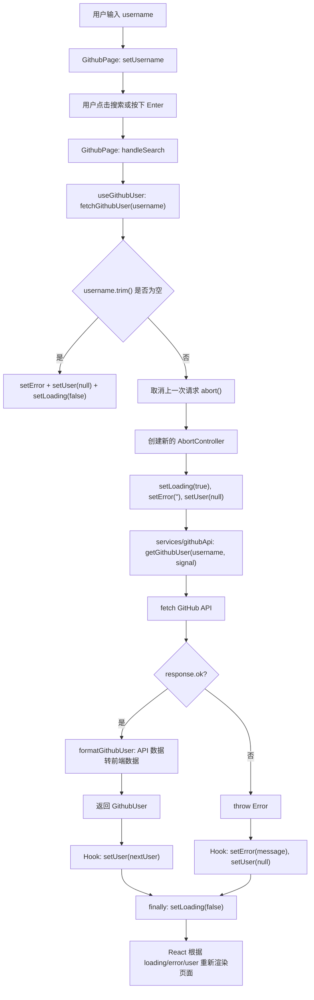

# GitHubSearch API 请求模式巩固

目标：能独立说清楚 `types -> services -> hooks -> components -> pages` 的职责，并能解释一次 GitHub 用户搜索请求从输入到渲染的完整流程。

## 一、五层职责

### 1. types：定义数据长什么样

`types` 层只负责类型建模，不请求接口，也不管理状态。

常见会有两个类型：

```ts
export type GithubApiUser = {
  login: string;
  name: string | null;
  avatar_url: string;
  bio: string | null;
  public_repos: number;
  followers: number;
};

export type GithubUser = {
  login: string;
  name: string | null;
  avatarUrl: string;
  bio: string | null;
  publicRepos: number;
  followers: number;
};
```

可以这样理解：

- `GithubApiUser`：GitHub API 原始返回数据，字段由后端决定。
- `GithubUser`：前端组件真正使用的数据，字段由前端页面决定。

`types` 的价值是提前约定数据结构，让后面的 `services`、`hooks`、`components` 都知道自己接收和返回什么。

## 二、services：只负责请求和数据转换

`services/githubApi.ts` 的职责是：

- 拼接请求地址。
- 调用 `fetch`。
- 判断响应是否成功。
- 把 API 原始数据转换成前端需要的数据。
- 返回结果或抛出错误。

典型结构：

```ts
import type { GithubApiUser, GithubUser } from "../types/github";

function formatGithubUser(data: GithubApiUser): GithubUser {
  return {
    login: data.login,
    name: data.name,
    avatarUrl: data.avatar_url,
    bio: data.bio,
    publicRepos: data.public_repos,
    followers: data.followers,
  };
}

export async function getGithubUser(username: string, signal?: AbortSignal) {
  const response = await fetch(`https://api.github.com/users/${username}`, {
    signal,
  });

  if (!response.ok) {
    throw new Error("没有找到这个 GitHub 用户");
  }

  const data: GithubApiUser = await response.json();
  return formatGithubUser(data);
}
```

### 为什么 githubApi 不 setState？

因为 `githubApi` 是请求工具层，不是 React UI 层。

`setState` 属于组件或 Hook 的状态管理逻辑。`githubApi` 如果直接 `setState`，就会和某个页面或组件绑定死，复用性会变差。

正确分工是：

- `githubApi`：我只负责“拿数据”。
- `useGithubUser`：我负责“请求前后怎么改状态”。
- `GithubPage`：我负责“什么时候发起请求”。
- `GithubUserCard` / `GithubFeedback`：我负责“根据状态显示什么”。

一句话口述：

> `githubApi` 不 `setState`，因为它不应该知道 React 页面怎么展示。它只返回数据或抛出错误，状态变化交给 Hook 处理。

## 三、hooks：封装请求状态和业务流程

`useGithubUser` 是整个请求模式的核心。

它负责把一次异步请求包装成页面能直接使用的四个东西：

```ts
const { user, loading, error, fetchGithubUser } = useGithubUser("octocat");
```

分别是：

- `user`：请求成功后的用户数据。
- `loading`：请求是否正在进行。
- `error`：请求失败或输入不合法时的错误信息。
- `fetchGithubUser`：触发请求的函数。

## 四、useGithubUser 每一步怎么解释

可以按这个顺序讲：

### 第一步：定义请求相关状态

```ts
const [user, setUser] = useState<GithubUser | null>(null);
const [loading, setLoading] = useState<boolean>(false);
const [error, setError] = useState<string>("");
```

这三个状态对应页面的三种核心展示：

- 有 `user`：显示用户卡片。
- `loading === true`：显示加载中。
- 有 `error`：显示错误信息。

### 第二步：用 useRef 保存 AbortController

```ts
const abortControllerRef = useRef<AbortController | null>(null);
```

`AbortController` 是一个“取消请求的控制器”。

放在 `useRef` 里，是因为：

- 它需要跨多次渲染保存。
- 修改它不需要触发页面重新渲染。
- 它不是 UI 状态，而是请求控制对象。

### 第三步：定义 fetchGithubUser

```ts
const fetchGithubUser = useCallback(async (rawUsername: string) => {
  const nextUsername = rawUsername.trim();

  if (nextUsername === "") {
    setError("请输入 GitHub 用户名");
    setUser(null);
    setLoading(false);
    return;
  }

  abortControllerRef.current?.abort();

  const controller = new AbortController();
  abortControllerRef.current = controller;

  setLoading(true);
  setError("");
  setUser(null);

  try {
    const nextUser = await getGithubUser(nextUsername, controller.signal);
    setUser(nextUser);
  } catch (error) {
    if (error instanceof DOMException && error.name === "AbortError") {
      return;
    }

    setError(error instanceof Error ? error.message : "请求失败");
    setUser(null);
  } finally {
    setLoading(false);
  }
}, []);
```

可以这样逐句解释：

1. `trim()`：去掉用户输入前后的空格，避免搜索 `" octocat "`。
2. 判断空字符串：如果没有输入，就不请求 API，直接给错误提示。
3. `abortControllerRef.current?.abort()`：发新请求前取消旧请求。
4. `new AbortController()`：给这一次请求创建新的取消控制器。
5. `setLoading(true)`：告诉页面现在开始请求。
6. `setError("")`：清掉上一次错误。
7. `setUser(null)`：清掉上一次用户数据，避免旧结果继续显示。
8. `await getGithubUser(...)`：调用 service 层真正发请求。
9. 请求成功：`setUser(nextUser)`。
10. 请求失败：设置 `error`，并清空 `user`。
11. `finally`：不管成功还是失败，请求结束后都关闭 loading。

### 第四步：用 useEffect 做初始请求

```ts
useEffect(() => {
  fetchGithubUser(initialUsername);

  return () => {
    abortControllerRef.current?.abort();
    abortControllerRef.current = null;
  };
}, [fetchGithubUser, initialUsername]);
```

这段表示：

- 组件第一次加载时，自动请求默认用户。
- 组件卸载时，取消还没完成的请求。
- 清理 `abortControllerRef.current`，避免保存无效控制器。

一句话口述：

> `useGithubUser` 把“请求前、请求中、请求成功、请求失败、组件卸载清理”全部封装起来，页面只需要拿状态和调用请求函数。

## 五、loading / error / user 三状态

这三个状态不是随便放的，它们分别控制不同 UI。

### 初始状态

```ts
user = null
loading = false
error = ""
```

页面还没有成功数据，也没有错误，也不在请求中。

### 请求中

```ts
user = null
loading = true
error = ""
```

页面可以显示“正在请求 GitHub API...”，按钮可以显示“搜索中...”。

### 请求成功

```ts
user = GithubUser
loading = false
error = ""
```

页面显示用户卡片。

### 请求失败

```ts
user = null
loading = false
error = "没有找到这个 GitHub 用户"
```

页面显示错误信息，不显示用户卡片。

### 为什么请求开始时要清空 error 和 user？

因为新的请求已经开始了，旧的错误和旧的用户都不再代表当前请求结果。

如果不清空：

- 搜索新用户时，旧用户卡片可能还留在页面上。
- 新请求 loading 时，旧错误可能还显示着。

一句话口述：

> `loading/error/user` 分别表示请求过程、失败结果、成功结果。页面不是手动操作 DOM，而是根据这三个状态自动渲染不同内容。

## 六、AbortController 为什么存在

`AbortController` 用来取消还没完成的请求。

它主要解决两个问题。

### 1. 连续搜索导致旧请求覆盖新请求

假设用户先搜 `octocat`，马上又搜 `gaearon`。

如果 `gaearon` 先返回，页面显示 `gaearon`。

但如果更早发出的 `octocat` 后返回，它可能又把页面改回 `octocat`。

这就是异步请求的竞态问题。

用 `AbortController` 后，每次发新请求前都会取消旧请求：

```ts
abortControllerRef.current?.abort();
```

这样旧请求不会再影响当前页面状态。

### 2. 组件卸载后避免继续更新状态

如果页面组件已经卸载，但请求稍后才返回，再调用 `setUser` / `setError` 就没有意义，还可能带来警告或异常行为。

所以在 `useEffect` 的清理函数里取消请求：

```ts
return () => {
  abortControllerRef.current?.abort();
  abortControllerRef.current = null;
};
```

一句话口述：

> `AbortController` 存在是为了取消过期请求，避免旧请求覆盖新请求，也避免组件卸载后请求还回来更新状态。

## 七、components：只负责展示和触发事件

组件层不应该直接写复杂请求逻辑。

例如 `GithubSearchForm`：

- 接收 `username`。
- 接收 `loading`。
- 接收 `onUsernameChange`。
- 接收 `onSearch`。
- 渲染输入框和按钮。

它不需要知道：

- GitHub API 地址是什么。
- 请求成功后数据怎么转换。
- `AbortController` 怎么用。
- `setUser` / `setError` 怎么管理。

一句话口述：

> components 接收 props，根据 props 渲染 UI，并在用户操作时调用父组件传来的事件函数。

## 八、pages：组织页面和连接业务

`GithubPage` 是页面容器，负责把状态、事件、组件组合起来。

典型职责：

```ts
const [username, setUsername] = useState("octocat");
const { user, loading, error, fetchGithubUser } = useGithubUser("octocat");
```

然后定义事件：

```ts
function handleSearch() {
  fetchGithubUser(username);
}
```

最后把数据交给组件：

```tsx
<GithubSearchForm
  username={username}
  loading={loading}
  onUsernameChange={handleUsernameChange}
  onSearchKeyDown={handleSearchKeyDown}
  onSearch={handleSearch}
/>

<GithubFeedback loading={loading} error={error} />

{user && <GithubUserCard user={user} />}
```

一句话口述：

> pages 负责组织页面级状态和事件，把 hooks 返回的数据分发给 components。

## 九、完整请求流程图



## 十、口述模板

### 模板 1：解释分层

这个项目按照 `types -> services -> hooks -> components -> pages` 拆分。

`types` 定义 API 原始数据和前端数据的结构。`services` 负责请求 GitHub API，并把下划线字段转换成前端更好用的驼峰字段。`hooks` 负责请求过程中的状态管理，比如 `loading`、`error`、`user`，也负责取消请求。`components` 只负责展示 UI 和触发事件。`pages` 负责组合 Hook 和组件，把页面流程串起来。

### 模板 2：解释 useGithubUser

`useGithubUser` 是请求用户信息的自定义 Hook。它内部维护 `user`、`loading`、`error` 三个状态，并返回一个 `fetchGithubUser` 函数。调用请求函数时，它先处理空输入，再取消上一次请求，然后创建新的 `AbortController`，设置 loading，清空旧错误和旧用户，调用 `getGithubUser` 发请求。成功就设置 `user`，失败就设置 `error`，最后关闭 loading。组件卸载时，它也会取消未完成的请求。

### 模板 3：解释 githubApi

`githubApi` 是 service 层，它只负责和接口通信。它不应该 `setState`，因为它不是 React 组件，也不应该知道页面如何展示。它只需要请求数据、处理响应、转换数据，然后返回结果或抛出错误。状态变化由 `useGithubUser` 这个 Hook 负责。

### 模板 4：解释三状态

`loading` 表示请求正在进行，`error` 表示请求失败或输入错误，`user` 表示请求成功后的数据。请求开始时设置 `loading=true`，并清空旧的 `error` 和 `user`。请求成功后设置 `user`，请求失败后设置 `error`，最后统一把 `loading` 改回 `false`。页面根据这三个状态决定显示加载提示、错误信息还是用户卡片。

### 模板 5：解释 AbortController

`AbortController` 是用来取消请求的。它可以避免用户连续搜索时，旧请求比新请求更晚返回并覆盖页面，也可以避免组件卸载后请求还回来更新状态。项目里用 `useRef` 保存当前请求的 controller，每次新请求开始前先 abort 旧请求，组件卸载时也会 abort 当前请求。

## 十一、自检问题

1. `GithubApiUser` 和 `GithubUser` 为什么要分开？
2. `formatGithubUser` 应该放在 service 层还是 component 层？为什么？
3. `getGithubUser` 为什么返回数据，而不是直接修改 `user`？
4. `useGithubUser` 里为什么请求开始时要清空旧 `user`？
5. `loading` 是不是可以从 `user === null` 推导出来？为什么不建议？
6. 为什么 `AbortController` 要放进 `useRef`？
7. 如果用户快速连续点击搜索，不取消旧请求会发生什么？
8. `GithubSearchForm` 为什么不直接调用 `getGithubUser`？
9. `GithubPage` 和 `useGithubUser` 的边界在哪里？
10. 如果以后换成搜索仓库 API，哪些层最可能复用，哪些层需要改？

## 十二、最终检查标准答案

### 能解释 useGithubUser 每一步

它定义请求状态，保存取消控制器，提供请求函数，处理空输入，取消旧请求，创建新请求，设置 loading，调用 service，成功写入 user，失败写入 error，最后关闭 loading，并在组件卸载时清理请求。

### 能解释 githubApi 为什么不 setState

因为它是 service 层，只负责请求和数据转换，不属于 UI 状态层。`setState` 应该放在 Hook 或组件中，否则 service 会和 React 页面耦合。

### 能解释 loading/error/user 三状态

`loading` 描述过程，`error` 描述失败，`user` 描述成功。页面通过它们决定显示加载、错误还是用户卡片。

### 能解释 AbortController 为什么存在

它用来取消过期请求，解决连续搜索时的请求竞态，也用于组件卸载时清理未完成请求。
